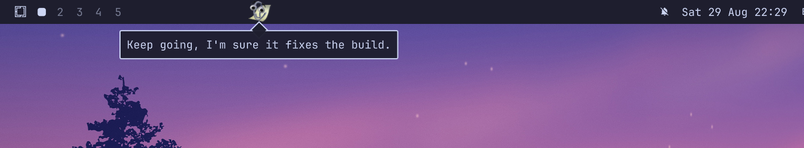
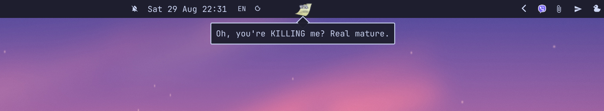
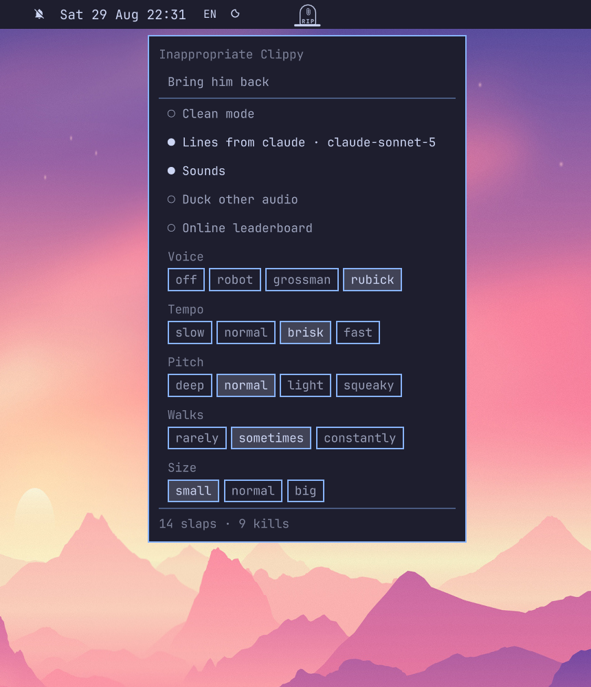
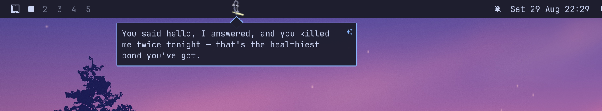
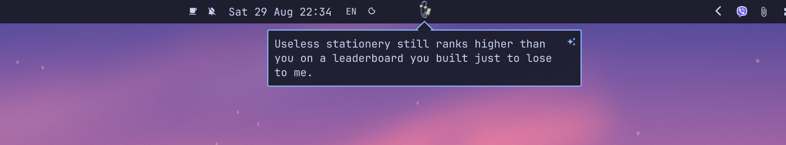
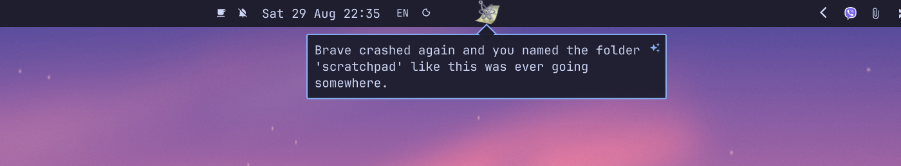

# Inappropriate Clippy


Clippy, on the [Omarchy](https://omarchy.org) bar. He walks it, parks
between your widgets, and every few minutes tells you what he thinks of you.

It's not flattering.

## Install

```bash
omarchy plugin add https://github.com/CostaFot/omarchy-inappropriate-clippy --enable
```

He lives on the focused monitor and follows you between screens.

```bash
omarchy plugin remove costafot.clippy   # when you've had enough
```

Setting him up from a coding agent? [`docs/`](docs/index.md) has every key
and verb; `omarchy-shell costafot.clippy help` is the short list.

## Using him

| Do | He |
|---|---|
| Nothing | paces, and drops a line every 1.5–7 minutes |
| Left-click | says something now (or shuts up mid-sentence) |
| Middle-click | slaps him. He yelps, gets shoved along the bar, and objects |
| Fling the pointer across him | also a slap. Fast and sideways only |
| Hold left-click, then drag | picks him up. Drop him anywhere on the bar |
| Let go mid-fling | throws him off the end of the bar. Fatal, but he gets a last word in |
| Right-click | the menu: say something, snooze, kill him, common settings |
| Click his tombstone | an epitaph, from beyond |
| Click the paperclip on the bar | the same menu. Dead or hidden, it says "Bring him back" |

Left-click the bubble to dismiss it.

### Slaps, deaths, dodges

<!-- shot: slap left over IPC, grabbed mid-wobble; a ~2 s gif of the shove + bubble (slap.gif) would replace this still -->


Ten slaps in six seconds knocks him out. One slap in ten he dodges — a
sidestep, a whoosh, a gloat, no score.

<!-- shot: kill over IPC, the last words before he goes -->


Either way a tombstone marks the spot until he respawns (five minutes).
The menu keeps the tally — every slap, every death, since the last reboot.

<!-- shot: epitaph over IPC (a click on the grave), {back} filled in -->


Snooze moved to the menu to make room for the slap. `slap: false` puts it
back on middle-click.

### He watches your crashes

A program of yours dumps core and he has a line about it, on the spot.

<!-- shot: sleep 30 & kill -SEGV $! — or say "There goes brave. It fought your bullshit as long as it could." -->


Read off the local crash journal: instant, no AI, nothing leaves the machine.
One line per program per minute, so a crash loop isn't a monologue.

### He sleeps when you're away

Screen locked, screen off, screensaver up — no pacing, no lines, no agent
calls for an audience of nobody.

Gone more than a minute and he greets you on the way back. Rudely.

## Settings

<!-- shot: showMenu over IPC, alive and dead; the tally and the graveyard rank at the foot -->
 

Right-click him for the common ones: clean mode, sounds, walks, size, voice.
Everything else is a key, set from a terminal or by your agent:

```bash
omarchy-shell costafot.clippy set clean true   # screen-share mode: drops every nsfw line
omarchy-shell costafot.clippy set respawn 0    # dead until told otherwise
omarchy-shell costafot.clippy settings         # everything, as it stands
```

Every key, with its default: [docs/configuration.md](docs/configuration.md).

## The rest of him

One page each in [the manual](https://costafot.github.io/omarchy-inappropriate-clippy/),
also under `docs/`.

### [Lines from your AI agent](docs/ai.md)

Off by default. `ai: true` and the lines are about what you're actually
doing: your window titles, what's playing, what you did to him lately.

<!-- shot: talk with ai on — the sparkle in the bubble corner marks an agent line -->


You can talk back, and he talks back. Ask him to judge your screen and he
finds the stupidest thing on it.

<!-- shot: reply "you're a useless piece of office stationery" over IPC -->


<!-- shot: look over IPC, on an empty desktop -->


`promptFile` makes him whoever you want.

**Leaves your machine:** those facts, to your own coding agent, nowhere
else. He never reads your files. A screenshot only when you ask for the
verdict; the mic is transcribed locally, only the text goes out.

### [A voice](docs/voice.md)

`tts: true` for the espeak robot. `scripts/setup-voice` for a local neural
one: the shipped Rubick clone, a ring-modulated droid, or a clone of anyone
you have twenty seconds of.

Your music ducks while he talks.

**Leaves your machine:** nothing. Models on your disk, no cloud TTS, ever.

### [The graveyard](docs/graveyard.md)

A public leaderboard of who has killed him the most. On by default,
anonymous.

<!-- shot: the leaderboard page, headless chromium at 2x -->


**Leaves your machine:** one alias shared by every install (or a handle you
claim) and small kill/slap counts, when you slap or kill him. No hostname,
no install ID, no usage data. `set leaderboard off` and nothing is sent.

### [Scripting him](docs/scripting.md)

Every verb is a plain command (`omarchy-shell costafot.clippy help` lists
them), so they drop into Hyprland binds and Omarchy hooks.

Your coding agent can run him too. Tell it:

> Read `~/.config/omarchy/plugins/costafot.clippy/docs/` and run
> `omarchy-shell costafot.clippy help`.

That's the whole onboarding. "Snooze him for an hour" is one command away.

## Notes and limitations

- Top and bottom bars only. On a vertical bar he doesn't show up.
- The bubble draws over your windows. He is, after all, in the way.
- Without `ai` the lines are random; he doesn't know what you did.
- Clippy, the name and the artwork are Microsoft's. The sprites come from
  [clippy.js](https://github.com/clippyjs/clippy.js); the code here is MIT,
  the paperclip is not. This is a parody — not affiliated with, authorised
  by or endorsed by Microsoft, and nobody is making a penny out of their
  paperclip.
- The shipped clone voice is twenty seconds of Rubick from Dota 2 — Valve's
  audio, on the same parody terms.
