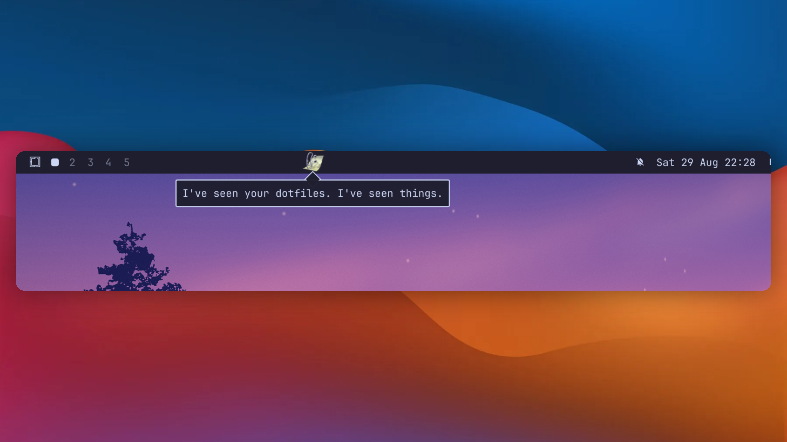

# Inappropriate Clippy



Clippy, on the [Omarchy](https://omarchy.org) bar. He walks the full width of it
— across your widgets, but parking in the gaps between them — and every few
minutes stops to tell you what he thinks of you. It's not flattering.

```bash
omarchy plugin add https://github.com/CostaFot/omarchy-inappropriate-clippy --enable
```

He's on the monitor Hyprland has focused, and follows you between screens.

## Using him

| Do | He |
|---|---|
| Nothing | paces, fidgets, and drops a line every 1.5–7 minutes |
| Left-click | says something now (or shuts up, if he's mid-sentence) |
| Middle-click | slaps him. He yelps, gets shoved along the bar, and has something to say about it |
| Fling the pointer across him | also a slap. Fast and sideways; a pointer merely passing over him on the way to the tray doesn't count |
| Hold left-click, then drag | picks him up. Put him down anywhere on the bar; he objects to the trip and to where it ends |
| Let go mid-fling | throws him off the end of the bar. He doesn't survive it, but he does get a last word in |
| Right-click | opens his menu: say something, snooze, kill him, and the settings below |
| Click his tombstone | he's dead, not quiet. An epitaph, from beyond |
| Click the paperclip on the bar | the same menu. When he's dead or hidden it says "Bring him back", which is the point of the paperclip |

Left-click the bubble to dismiss it.

Ten slaps inside six seconds and he's out cold, same as a kill; `slapsToKill`
below changes the number (`0` and he takes it forever). However he goes, a
little tombstone marks the spot until he's back. The menu keeps score at
the bottom — every slap, every death (well, since the last reboot; he
forgives nothing, but the shell forgets). Snooze moved to the
menu to make room for the slap; `"slap": false` gives middle-click back to it.

He sleeps when you're away: the screen locked or off, or Omarchy's idle
screensaver up. No pacing, no lines, and no calls to your agent for an
audience of nobody. He's back the moment you are, and if you were gone more
than a minute he has something to say about it ("Welcome back, dipshit.").
If his respawn came due while you were gone, he comes back with it.

## Configuration

The menu covers the common ones (clean mode, sounds, how much he walks, size) and
writes them for you. Everything goes on his entry in
`~/.config/omarchy/shell.json`. He has a bar icon, so that entry lives in the
bar layout with the other widgets. All optional.

```json
"bar": {
  "layout": {
    "right": [
      { "id": "costafot.clippy", "size": 30, "clean": false, "intervalMin": 90, "intervalMax": 420 }
    ]
  }
}
```

The paperclip moves like any widget: `omarchy bar move costafot.clippy --section left`.
Installs from before it existed have the entry under `plugins`; he moves it
into the bar himself, settings and all.

| Key | Default | What |
|---|---|---|
| `size` | `30` | His height in px. The bar is 26, so he hangs over the edge a bit |
| `clean` | `false` | `true` drops every line tagged `nsfw`. Screen-share mode |
| `intervalMin` / `intervalMax` | `90` / `420` | Seconds between unprompted lines |
| `speed` | `40` | Walking speed, px/s |
| `restless` | `0.3` | 0–1, how often he decides to walk (about once a minute at the default; `1` is constant pacing) |
| `avoidWidgets` | `true` | When he picks where to walk he tries not to park on the clock, the tray or your workspaces. Soft — a drag or a slap still leaves him wherever it leaves him |
| `tombstone` | `true` | A little headstone where he died, up until the respawn. It parks in a widget gap like he does; click it for an epitaph, right-click it for the menu |
| `respawn` | `300` | Seconds he stays dead after you kill him. `0` = dead until told otherwise |
| `pauseWhenAway` | `true` | He sleeps while the screen is locked or off, or the idle screensaver is up. `false` and he carries on regardless |
| `screen` | focused | A monitor name (`hyprctl monitors`) to pin him to one screen |
| `quotesFile` | — | Path to your own quotes JSON, merged into his |
| `slap` | `true` | `false` turns slapping off. Middle-click snoozes again |
| `slapSwipe` | `true` | `false` keeps middle-click but stops the pointer-fling counting as a slap |
| `slapSound` | `true` | `false` mutes it; a path to a WAV plays that instead of the built-in three |
| `flingSound` | follows `slapSound` | The falling sound when he's thrown. `false`, or a path to a WAV instead of the built-in two |
| `slapsToKill` | `10` | That many slaps inside six seconds knocks him out, same as a kill. `0` = never |
| `drag` | `true` | `false` stops the long-press drag |
| `fling` | `true` | `false` makes a fast release just a drop, not a throw |
| `tts` | `false` | `true` and he says every line out loud through `espeak-ng` (install that yourself); a shell command as a string gets each line on stdin instead. See below |
| `ttsVoice` | `en+m3` | The built-in voice — any name from `espeak-ng --voices`. Death still whispers |
| `ttsSpeed` | `155` | Words per minute for the built-in voice (espeak-ng `-s`, 80–450) |
| `ttsPitch` | `45` | Pitch for the built-in voice (espeak-ng `-p`, 0–99) |
| `ttsSaved` | — | Where a custom `tts` command parks while the voice is toggled off, so toggling doesn't lose it. Managed for you; `set ttsSaved unset` forgets it |
| `cloneTempo` | `1` | How fast a cloned voice talks, pitch untouched — `1.1` is a little brisker, `0.9` slower (0.5–2). Instant: derived from the line cache, never the GPU |
| `clonePitch` | `1` | Pitch for a cloned voice, tempo untouched — `0.85` deeper, `1.2` lighter (0.5–2). Set both knobs the same for the full chipmunk |
| `duck` | `0.8` | The fraction of volume everything else keeps while he talks (0–1). `0.5` halves your music, `1` or `false` turns ducking off. The menu only toggles; the ratio is IPC-only |
| `duckSaved` | — | Where a custom `duck` ratio parks while ducking is toggled off, so toggling doesn't lose it. Managed for you |
| `ai` | `false` | `true` and his lines come from your AI agent, about what you're actually doing. See below |
| `aiAgent` | your default | Which agent to use (`claude`, `codex`, `opencode`, `pi`, ...) if not the one `omarchy default agent` set |
| `aiModel` | the agent's default | A model name for it, e.g. `claude-sonnet-5`. Cheaper is fine; it's a paperclip. The menu shows it next to the agent's name |
| `greeted` | `false` | Set to `true` by his first-boot hello (the one telling you to set him up), so he only says it once per install. `set greeted unset` to hear it again |
| `leaderboard` | — | Who the kill/slap counts post as on [the public graveyard](https://clippy-leaderboard-production.up.railway.app). Unset posts to the shared `anonymous-clippy-abuser` stone, a handle claims your own, `off` stops posting. See below |
| `leaderboardSaved` | — | Where a handle parks while the graveyard is toggled off, so toggling doesn't lose it. Managed for you |

`quotesFile` takes the same shape as [`quotes.json`](quotes.json): an array of
`{ "text": "...", "nsfw": true }` (plain strings work too), or an object with
`quotes`, `lastWords`, `comeback`, `slapped`, `knockedOut`, `dragged`, `dropped`,
`flung`, `welcomeBack`, `epitaph` and `firstRun` arrays. `{away}` in a `welcomeBack` line
becomes how long you were gone ("47 minutes", "3 hours"); `{back}` in an
`epitaph` becomes how long until he's back ("4 minutes", "never").

## Letting your AI agent write his lines

Turn on "Lines from claude" in the menu (or `"ai": true`) and the random book
is replaced with remarks about what you are actually doing. Every so often he
gathers the evidence: your open window titles, what's playing, what you've
done to him lately (slaps, drags, the odd murder), and anything currently
embarrassing — a dying battery, an uptime or a pacman sync measured in weeks,
a program that dumped core today, a live microphone, more than half your
agent plan gone. Plus a random few draws from the shame pool: what's rotting
in `~/Downloads` (filenames included), the screenshot hoard, repos in
`~/Work` with uncommitted changes (names included), your most-typed shell
command, the trash, the browser tab count. He hands all of it to your coding
agent as text and asks for five lines in his voice, with a handful of lines
from the book (and your `quotesFile`) as examples of how far to go. They're
cached and handed out one at a time, so a click never waits on a model.

The agent is whichever `omarchy default agent` picked, run the way `omarchy
agent prompt` runs it but in its one-shot mode with tools off: it gets the
facts as text and can only answer. Nothing on your machine is touched. It does
mean the window title and the rest of that list are sent wherever that agent
sends its prompts, and every batch spends a little of your plan: one small
call every 15 minutes or so at the default pace, more if you keep clicking
him, never more than one a minute. It runs on the agent's default model
unless `aiModel` says otherwise. For claude that is the CLI's default (opus),
not the `model` in your `settings.json`, because the call runs with your
settings off so it doesn't load your CLAUDE.md and hooks. A smaller model
does the job fine (`claude-sonnet-5` answered in 4 s, same as opus; haiku 4.5
oddly took a minute). `clean` applies to these lines too. You can tell his
lines apart: an agent line gets the theme's accent colour on the bubble and a
little sparkle in the corner. Whenever the agent is unset, not logged in,
offline or slow, the book takes over and you won't notice, except that the
sparkle is gone.

And when you want a verdict on demand: "Judge my screen" in the menu (or
`omarchy-shell costafot.clippy look`) screenshots the monitor he is standing
on, hands the picture to the same agent, and ~10 seconds later the jab lands
in his bubble — he visibly inspects the screen while the model chews on it.
This one cites what it can actually **see** (the tab, the window, the thing
you are pretending to read), which is where the good material was all along.
The screenshot goes wherever your agent sends its prompts, same as the facts
above — but only when you ask: he never takes one on his own, not on a timer,
not ever, and the file is deleted the moment the call returns. `claude` reads
the image natively and `codex` gets it attached; any other agent gets the
file path in the prompt and does what it can with it.

Verified with `claude` and `opencode`; `codex` and `pi` are wired the same way
but weren't run here, and the rest are best guesses from their docs. To see
what he'd send, or try an agent by hand:

```bash
~/.config/omarchy/plugins/costafot.clippy/scripts/clippy-ai --context
~/.config/omarchy/plugins/costafot.clippy/scripts/clippy-ai --prompt
~/.config/omarchy/plugins/costafot.clippy/scripts/clippy-ai --agent opencode
```

## Giving him a voice

`"tts": true` and every line in the bubble is also said out loud, in the most
correctly stupid robot voice available: `espeak-ng`. It isn't installed with
the plugin — `sudo pacman -S espeak-ng` and he starts talking; without it he
stays silent and tells on himself everywhere you might look: he says so in a
bubble the moment you switch the voice on, the menu row reads "Voice ·
install espeak-ng", and for agents and scripts `voice` answers with what's
wrong and the fix, `set tts true` and a silent `say` warn in their replies,
and one line lands in the journal. Epitaphs are whispered, because he's dead.

The robot takes tuning before you replace him: `ttsVoice` is any name from
`espeak-ng --voices` (`en+f3`, `en+croak`, `en+Tweaky`, ...), `ttsSpeed` and
`ttsPitch` are espeak-ng's `-s` and `-p`. One command, from you or your agent:

```bash
omarchy-shell costafot.clippy set ttsVoice en+croak
```

Epitaphs stay whispered whatever you pick.

If you'd rather he sounded good (why?), `scripts/setup-voice` does the whole
thing locally: it installs a neural TTS into a venv, downloads what it
needs, and points `tts` at it. No cloud calls, a model on your disk, and
the espeak robot is one `set tts true` away. Bare, it checks what you're
running on: an NVIDIA GPU with 6 GB to spare gets the shipped voice — a
clone of Rubick the Grand Magus, built from the 20-second sample in
`assets/voices/` (Dota 2 audio, © Valve) — and anything less gets the
blessed robot,
[kokoro](https://github.com/thewh1teagle/kokoro-onnx)'s `bm_george` (~340 MB)
put through a ring-modulated robot chain: a fussy English droid, dialed in
by ear. `--robot` skips the GPU check and gets you the droid anyway. Pass a
name for any
[kokoro voice](https://huggingface.co/hexgrad/Kokoro-82M/blob/main/VOICES.md)
unprocessed (`af_heart`, `am_adam`, `jf_alpha`, ...) or, with a dash in the name, any
[piper catalog](https://rhasspy.github.io/piper-samples/) voice like
`en_US-ryan-high` — a lighter engine (~60–120 MB) that sounds it.

And the fun one — give him **any voice you have a sample of**, yours
included:

```bash
scripts/setup-voice --clone ~/glados-lines.mp4 glados
scripts/setup-voice --clone ~/whole-scene.mp4 glados --from 1:33 --to 1:56
```

Ten to twenty seconds of clean speech, any format ffmpeg reads. `--from`
and `--to` (ffmpeg times: `95`, `1:35`, `0:01:35.5`) cut the sample out
of a longer recording, so a downloaded scene works as-is; it's capped at
20 s either way. The sample is loudness-normalised on the way in — a
quiet rip needs no volume prep. What does matter is what's *under* the
voice: a film mix with score and room tone under the dialogue clones
muddy, and a shouted reference gives a strained voice on every line, so
pick the driest, calmest stretch you can find. The script prints the
cut's length and warns when it's short. Re-cloning a name replaces its
sample; lines rendered from the old one are never reused (the line cache
is keyed by the sample's contents), and the book is re-rendered for the
new one like a fresh clone. Cloning uses
[chatterbox](https://github.com/resemble-ai/chatterbox), so it needs an
NVIDIA GPU and pulls ~8 GB on first run — the shipped Rubick is this exact
machinery pointed at a sample we picked for you, so the same costs apply.
A small daemon keeps the model warm
between lines and exits after 15 idle minutes to give your VRAM back; every
line is cached, so anything he's said before plays instantly and a fresh
line costs a few seconds of GPU. Every clone shows up by name in the
menu's Voice picker, and IPC `voice` tells your agent the whole story.
Temper your expectations: the clone gets the accent and the cadence, not
the soul. It's fun. It is not amazing.

Tuning the clone: `cloneTempo` and `clonePitch` are settings like any other,
and the menu grows Tempo and Pitch rows (slow · normal · brisk · fast,
deep · normal · light · squeaky) whenever a clone voice is the one talking.
`set cloneTempo 1.1` and he talks a little faster, pitch untouched;
`set clonePitch 0.85` and he's noticeably deeper, tempo untouched; both to
`1.2` and you've built the chipmunk. They're applied to the line cache with
ffmpeg, never the GPU, so auditioning values is instant and the warm cache
stays warm. The synthesis itself is still tuned by editing the `tts`
string's `--exag` and `--cfg` knobs (both up = snappier delivery) — those
re-render every line, so rerun `scripts/warm-voice` after.

A fresh clone starts with an empty cache, so *every* line would cost
those few seconds — including the reaction to a slap, which would land
well after the slap. So he doesn't leave it empty: the moment a clone
becomes his voice (a new clone, a switch in the picker, a shell start)
he renders the whole book into the cache in the background, silently —
10-20 minutes of GPU for the built-in book, once per voice; `voice` says
while it's running. He's usable meanwhile, and a voice warmed once stays
warm — the cache is keyed by the sample's contents and never thrown away,
so on every later start this is a half-second check. The same job by
hand is `scripts/warm-voice`, for after changing the delivery knobs.
Agent lines are freshly written every
time, so the cache can never have them in advance — instead the plugin
pre-renders each batch the moment it arrives (they sit unspoken for a
while first), so with `ai` on and a clone set, those don't trail the
bubble either.

Or set `tts` to any shell command yourself.
It runs through `bash -c` and gets each line on stdin, so any engine that
reads text from stdin plugs in:

```bash
omarchy-shell costafot.clippy set tts "piper --model ~/voices/en_US-lessac-medium.onnx --output-raw | aplay -q -t raw -r 22050 -f S16_LE -c 1 -"
```

A custom command ignores the three tuning keys — it's one string, it gets
stdin, you own everything. And it survives the on/off switch: toggling the
voice off (menu row or `set tts false`) parks the command in `ttsSaved`,
and toggling back on restores it — you only get the espeak robot from
`tts true` when there's nothing parked (`set ttsSaved unset` to force
that). Whatever hides the bubble — a slap, a click, a
lock — kills the voice mid-word, whichever voice is set: the espeak robot
and the clones die with their process (speak-clone becomes aplay by play
time), and the commands `setup-voice` writes for kokoro and piper wrap the
pipeline in a trap so the kill reaches their aplay too. A hand-rolled
command like the example above may finish its sentence anyway — bash sits
on signals while a foreground pipeline runs. Borrow the wrap if that
bothers you: `trap 'kill $! 2>/dev/null' TERM; <your pipeline> & wait $!`.
The bubble's own timers wait their turn, though: a long line stays on
screen until he's actually finished saying it, and his last words — a
kill, a knockout, a fling — get said in full before he goes, instead of
cutting him off mid-rant.

A hand-set command shows up in the menu as "custom". If you'd rather it
had a name — or you keep a few engines around — make it a **drop-in**:
a file at `~/.local/share/clippy-voices/<name>` whose first
non-comment, non-blank line is the command (everything above can be `#`
notes to yourself). The filename becomes the voice: it appears in the
menu's Voice picker and in `voices` by name, and `useVoice <name>`
switches to it like any other. Same raw contract as `set tts` — one
shell command, line on stdin, the trap wrap above included if you want
clean cut-offs — just with a name on it:

```bash
mkdir -p ~/.local/share/clippy-voices
cat > ~/.local/share/clippy-voices/lessac <<'EOF'
# piper lessac, hand-installed
trap 'kill $! 2>/dev/null' TERM; piper --model ~/voices/en_US-lessac-medium.onnx --output-raw | aplay -q -t raw -r 22050 -f S16_LE -c 1 - & wait $!
EOF
omarchy-shell costafot.clippy useVoice lessac
```

Running `useVoice` right on the heels of writing the file is fine — he
rescans the dir and switches the moment the scan lands. Names are
`[A-Za-z0-9_.-]`, and `off`/`robot`/`espeak`/`george`/`custom`
are taken. Drop-ins are for plugging in an engine you already run — the
clone knobs and `warm-voice` don't apply to them (those are shaped
around `speak-clone`'s cache).

When he talks, everything else steps back. The moment a line starts,
every other audio stream dips to 80% of its volume — Spotify, a browser
tab, a game, whatever's playing — and comes back the instant he's done.
Voice assistants call this ducking; he does it by default because he
considers what he has to say more important than whatever you were
listening to. The `duck` setting is the fraction the others keep:
`set duck 0.5` halves them, `set duck false` (or the menu's "Duck other
audio" row) leaves your music alone. It works with any engine, the
espeak robot and the clones alike, only touches streams that were
already playing when the line started (so his own voice is never
ducked, and neither are his own sound effects), and volumes are
snapshotted and restored exactly — if the shell dies mid-sentence, the
next mount puts them back. A slap
reaction gets both, in order: the crack plays first at full volume, and
the moment it ends he speaks the line — the voice never talks over its
own sound effect.

Once voices are on disk, switching between them takes no terminal: the
menu's Voice row is a picker showing everything installed — off, the espeak
robot, robot george, every clone you've made, every piper model, every
drop-in file — and a tap
switches instantly. Nothing in the menu ever downloads; installing a NEW
voice is always `scripts/setup-voice`. The same picker speaks IPC for your
agent: `voices` lists what's installed and where new ones come from,
`useVoice rubick` switches (and answers with the fix when it can't —
missing engine, no GPU, unknown name). Both are fed by
`scripts/voice-scan`, one JSON object of every voice on the machine, which
your agent can also run directly.

## The graveyard

There is a [public leaderboard](https://clippy-leaderboard-production.up.railway.app)
— a graveyard, one headstone per handle, sized by how many times its owner
has killed him. Slaps are the tiebreak. By default every install posts to
one shared stone, `anonymous-clippy-abuser` — the whole nameless world
piled into a single grave. Claim a stone of your own with any handle:

```bash
omarchy-shell costafot.clippy set leaderboard yourname
```

What leaves your machine: that alias (or your handle) and small kill/slap
counts, POSTed when you slap or kill him. Nothing else — no hostname, no
install ID, no usage data, no cookies. The server stores only handles and
counts; like any web request it sees your IP in transit, and keeps nothing
of it. Don't want even that? The menu's "Online leaderboard" row toggles the
posting off, or:

```bash
omarchy-shell costafot.clippy set leaderboard off
```

There are no accounts: handles are first-come, never-owned, so anyone can
post as you, two people with the same name share a grave, and a while-loop
over `slap left` is an instant world record. All of that is fine. Every
score was self-reported murder to begin with. There is no delete either —
the grave keeps what you already confessed.

## Scripting him

```bash
omarchy-shell costafot.clippy help       # every verb, one per line — start here
omarchy-shell costafot.clippy say "Another theme. That'll fix it."
omarchy-shell costafot.clippy talk       # a line of his own, what a click does
omarchy-shell costafot.clippy look       # screenshots his screen; the agent's verdict lands in his bubble (needs ai on)
omarchy-shell costafot.clippy shutUp
omarchy-shell costafot.clippy snooze 30  # unsnooze wakes him early
omarchy-shell costafot.clippy slap left   # or right: the way he flies
omarchy-shell costafot.clippy fling left  # off that end of the bar; fatal
omarchy-shell costafot.clippy kill
omarchy-shell costafot.clippy respawn
omarchy-shell costafot.clippy hide        # show brings him back, from hidden or dead
omarchy-shell costafot.clippy toggle
omarchy-shell costafot.clippy showMenu  # the menu; hideMenu closes it
omarchy-shell costafot.clippy state      # idle | walking | talking | dying | dead | snoozed | hidden | asleep
omarchy-shell costafot.clippy ai         # off, or "claude: 2 cached (40s old), last call 41s ago"
omarchy-shell costafot.clippy voice      # off, "espeak-ng: ready", "espeak-ng: not installed — silent (...)", or the custom command
omarchy-shell costafot.clippy voices     # every voice installed on this machine, and where new ones come from
omarchy-shell costafot.clippy useVoice rubick  # switch to any installed voice by name
omarchy-shell costafot.clippy stats      # the lifetime tally: "34 slaps, 5 kills"
omarchy-shell costafot.clippy leaderboard  # "posting anonymously to the shared ... stone", "posting as costa: #4 of 31 ...", or off
omarchy-shell costafot.clippy set clean true   # any key from the table; "unset" puts the default back
omarchy-shell costafot.clippy get clean        # the value in effect, as JSON
omarchy-shell costafot.clippy settings         # all of them
```

That is also enough for your coding agent to run him: point it at this file
(`~/.config/omarchy/plugins/costafot.clippy/README.md`) and "make Clippy
clean, I'm sharing my screen" or "snooze him for an hour" is one command
away. An agent that has never seen this file can bootstrap from `help`
alone: it lists every verb, and `voice`, `ai` and the `set` replies say
what's wrong and how to fix it.
`set` writes the key to `shell.json` for you, same as the menu does.
Replies come back on stdout (`ok`, `not now`, `hidden`, `asleep`...), and
`qs ipc -n -p "$OMARCHY_PATH/shell" show` lists every method with its arguments.

Omarchy is keyboard-first and these are plain commands, so any of them
drops straight into a Hyprland bind:

```conf
# ~/.config/hypr/bindings.conf
bindd = SUPER SHIFT C, C, Toggle Clippy, exec, omarchy-shell costafot.clippy toggle
bindd = SUPER SHIFT C, T, Clippy talks, exec, omarchy-shell costafot.clippy talk
bindd = SUPER SHIFT C, J, Clippy judges the screen, exec, omarchy-shell costafot.clippy look
```

`say` works from anywhere, so an Omarchy hook can feed him lines:

```bash
# ~/.config/omarchy/hooks/theme-set.d/clippy
omarchy-shell -q costafot.clippy say "Oh good, another theme. That'll fix it."
```

## Notes and limitations

- Top and bottom bars only. On a vertical bar he doesn't show up.
- The bubble draws over the top of your windows. He is, after all, in the way.
- Out of the box the lines are random; he doesn't know what you did. With
  `ai` on he does, roughly.
- Clippy, the name and the artwork are Microsoft's. The sprites come from
  [clippy.js](https://github.com/clippyjs/clippy.js); the code here is MIT, the
  paperclip is not. This is a parody. It is not affiliated with, authorised by
  or endorsed by Microsoft, and it is free — nobody is making a penny out of
  their paperclip.
